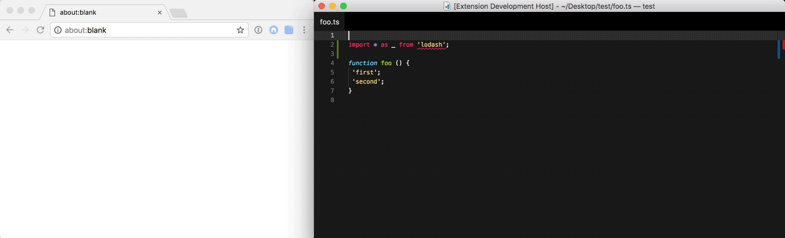

# VSC Open in NPM

<p align="center">
	
</p>

Open the current selection, project, or arbitrary string, in npmjs.com.

## Install

Run the following in the command palette:

```shell
ext install vscode-open-in-npm
```

## Usage

It adds 1 command to the command palette:

```js
'Open in NPM' // Open the current selection, project, or arbitrary string, in npmjs.com.
```

## Demo



## License

MIT © Fabio Spampinato
